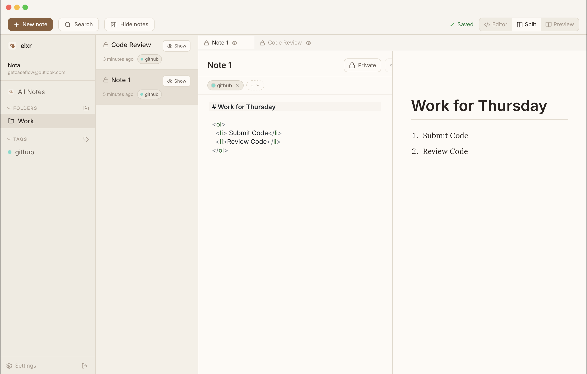
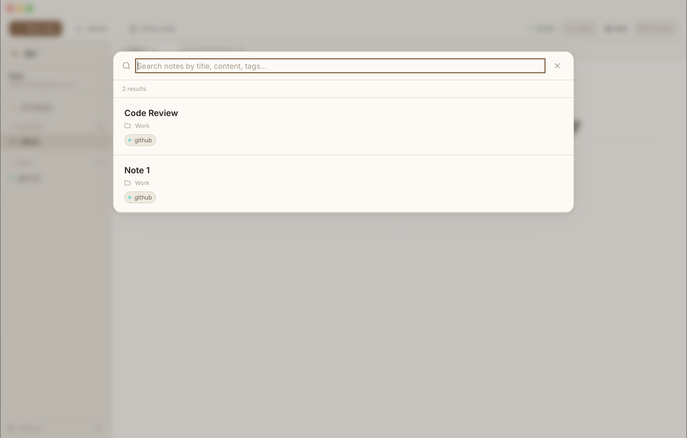
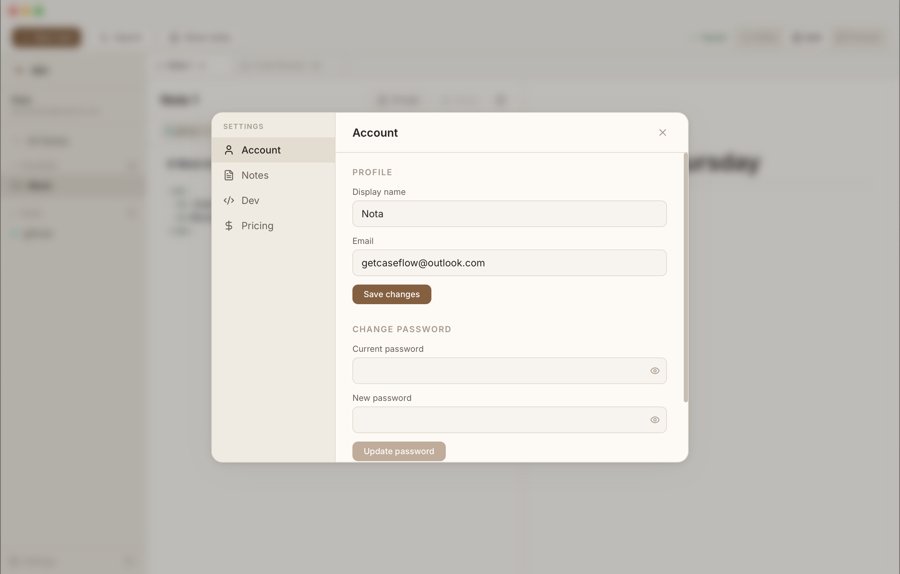
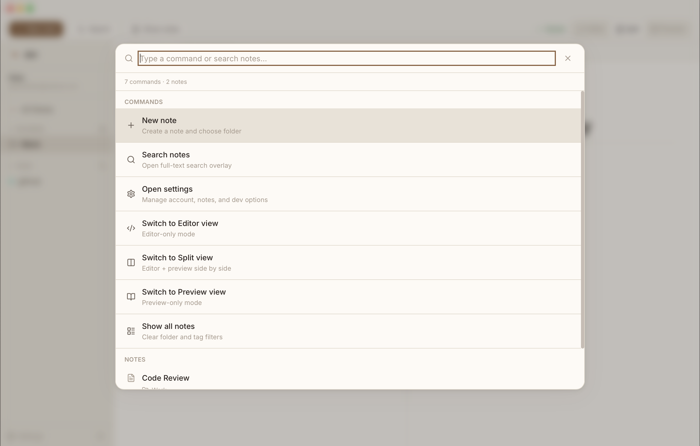

	
	<h1>Elxr</h1>
	
<strong>Private-by-default notes.</strong> Clean writing flow, markdown speed, and intentional sharing.

	
	
	

## What Elxr Does

Elxr is a laptop-first desktop app for capturing ideas, organizing notes, and sharing only what you choose.

- Markdown-first writing with a calm paper-like interface
- Folders, tags, tabs, and quick search to stay organized
- Private by default with deliberate public sharing controls
- Designed for long writing sessions without visual noise

## Download

- macOS DMG: [Download Elxr](https://github.com/llv03/elxr-site/releases/download/elxr-0.1-dmg/elxr_0.1.0_universal.dmg)

## Screenshots

	
	

	
	

## Stack

- Tauri v2
- React + TypeScript
- Rust backend
- MongoDB
